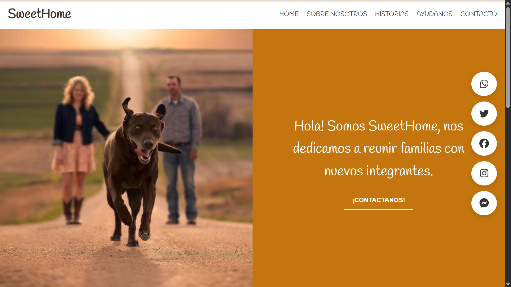

# 🏠 SWEETHOME - Real Estate Landing Page

¡Bienvenido a **SWEETHOME**! Este es uno de mis primeros proyectos de desarrollo web, donde me enfoqué en crear una interfaz moderna, atractiva y funcional para una plataforma de bienes raíces.

## 🚀 Sobre el Proyecto

SWEETHOME es una landing page diseñada para mostrar propiedades de lujo, servicios inmobiliarios y testimonios de clientes. El objetivo principal fue practicar la maquetación web, el uso de Flexbox/Grid y la organización de estilos CSS.

### ✨ Características principales:
- **Diseño Responsivo:** Adaptado para diferentes tamaños de pantalla (móviles, tablets y desktop).
- **Interfaz Moderna:** Uso de tipografías limpias y una paleta de colores profesional.
- **Secciones Clave:** Hero section con llamada a la acción, galería de propiedades, servicios y sección de contacto.

## 🛠️ Tecnologías utilizadas

Para este proyecto utilicé las siguientes herramientas:

* **HTML5:** Estructura semántica del sitio.
* **CSS3:** Estilos personalizados, animaciones y diseño responsivo.
* **Google Fonts:** Para una tipografía elegante y legible.
* **Font Awesome:** Iconografía para los detalles del sitio.

## 📂 Estructura del Repositorio

```text
SWEETHOME/
├── css/            # Archivos de estilos (main.css, etc.)
├── img/            # Recursos visuales y fotografías de propiedades
├── index.html      # Archivo principal de la landing page
└── README.md       # Documentación del proyecto
```

## 📸 Capturas de Pantalla


## 🚀 Cómo ver el proyecto
Puedes clonar este repositorio y abrir el archivo index.html en tu navegador:

```Bash
git clone https://github.com/Antonela89/SWEETHOME.git
```

O puedes verlo aquí: [SWEETHOME](https://antonela89.github.io/SWEETHOME/)

## 👤 Autora
Antonela Borgogno

⭐️ Si te gustó este proyecto, ¡no dudes en darle una estrella!
